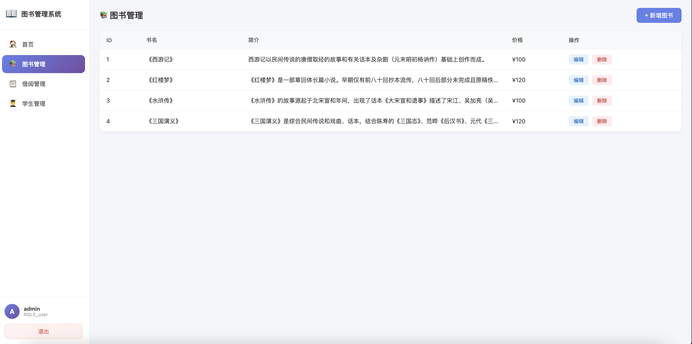

# 🚀 SpringBoot-Vue-Template-Jwt

> 一个「**好玩又好学**」的全栈练习项目 —— 后端以 **Spring Boot 4 + JWT + MyBatis-Plus** 实践认证授权与 RESTful CRUD；前端用 **Vue 3 + PixiJS + matter.js** 探索 2D 物理游戏与图书后台管理系统的结合。适合用来练手 Spring Boot 4 新特性、前后端联调、以及趣味交互开发。


## 📸 截图



---

## 🏗 项目结构

```
SpringBoot-Vue-Template-Jwt/
├── spring-boot-full-stack/    # 🖥 主后端 —— Spring Boot 4 认证 + 图书管理系统
├── pixijs-full-stack/         # 🎮 主前端 —— 登录页 + 愤怒小鸟游戏 + 管理后台
├── my-project-backend/        # 🗄 旧版后端 —— Spring Boot 3 参考实现
├── database.sql               # 📦 MySQL 数据库初始化脚本（account 表）
├── book.sql                   # 📚 图书表测试数据
├── borrow.sql                 # 📋 借阅表测试数据
├── student.sql                # 👨‍🎓 学生表测试数据
└── README.md
```

---

## 🖥 后端 —— `spring-boot-full-stack`

### 技术栈

| 依赖 | 版本 | 用途 |
|------|------|------|
| Spring Boot | 4.1.0 | 框架基础 |
| Java | 17 | 运行环境 |
| Spring Security | 6.x | 认证与授权 |
| MyBatis-Plus | 3.5.16 | ORM |
| java-jwt | 4.3.0 | JWT 令牌 |
| Redis | - | JWT 黑名单 / 验证码 / 限流 |
| RabbitMQ | - | 异步邮件发送 |
| MySQL | 8.0+ | 数据库 |
| SpringDoc OpenAPI | 2.1.0 | Swagger 文档 |

### API 接口

**认证模块：**

| 方法 | 路径 | 说明 | 需认证 |
|------|------|------|--------|
| `POST` | `/api/auth/login` | 登录（form-urlencoded） | ❌ |
| `GET` | `/api/auth/logout` | 退出登录 | ✅ |
| `POST` | `/api/auth/register` | 邮箱注册 | ❌ |
| `GET` | `/api/auth/ask-code` | 请求邮件验证码 | ❌ |
| `POST` | `/api/auth/reset-confirm` | 重置密码 - 验证 | ❌ |
| `POST` | `/api/auth/reset-password` | 重置密码 - 执行 | ❌ |

**图书管理模块：**

| 方法 | 路径 | 说明 | 需认证 |
|------|------|------|--------|
| `GET` | `/api/book/list` | 查询全部图书 | ✅ |
| `GET` | `/api/book/{id}` | 根据 ID 查询图书 | ✅ |
| `POST` | `/api/book/add` | 新增图书 | ✅ |
| `PUT` | `/api/book/update` | 更新图书 | ✅ |
| `DELETE` | `/api/book/{id}` | 删除图书 | ✅ |

**借阅管理模块：**

| 方法 | 路径 | 说明 | 需认证 |
|------|------|------|--------|
| `GET` | `/api/borrow/list` | 查询全部借阅记录 | ✅ |
| `GET` | `/api/borrow/{id}` | 根据 ID 查询借阅记录 | ✅ |
| `POST` | `/api/borrow/borrow` | 借书 | ✅ |
| `DELETE` | `/api/borrow/return/{id}` | 还书 | ✅ |

**学生管理模块：**

| 方法 | 路径 | 说明 | 需认证 |
|------|------|------|--------|
| `GET` | `/api/student/list` | 查询全部学生 | ✅ |
| `GET` | `/api/student/{id}` | 根据 ID 查询学生 | ✅ |
| `POST` | `/api/student/add` | 新增学生 | ✅ |
| `PUT` | `/api/student/update` | 更新学生 | ✅ |
| `DELETE` | `/api/student/{id}` | 删除学生 | ✅ |

**响应格式：**
```json
{ "sid": 123456, "code": 200, "data": {...}, "message": "请求成功" }
```

**登录成功返回：**
```json
{ "username": "admin", "role": "user", "token": "eyJ...", "expire": "2026-06-28T..." }
```

### 启动后端

```bash
# 前置依赖
# 1. MySQL 8.0+（创建数据库 test 并执行 database.sql）
# 2. Redis 6.0+
# 3. RabbitMQ（可选，用于邮件发送）
# 4. Mailpit（可选，本地邮件调试）

cd spring-boot-full-stack

# 开发模式启动
mvn spring-boot:run -P dev

# Swagger 文档
# http://localhost:8080/swagger-ui/index.html
```

### 配置文件

| 文件 | 用途 |
|------|------|
| `application.yaml` | 主配置，激活 profile |
| `application-dev.yaml` | 开发环境（本地 MySQL/Redis/Mailpit） |
| `application-prod.yaml` | 生产环境（需修改数据库/邮件等配置） |

### 认证流程

```
POST /api/auth/login (username + password)
  → UsernamePasswordAuthenticationFilter 验证
  → onAuthSuccess() 生成 JWT
  → 返回 { token, expire, username, role }

后续请求 Authorization: Bearer <token>
  → JwtAuthorizeFilter 解析令牌
  → 设置 SecurityContext
  → 放行到 Controller
```

---

## 🎮 主前端 —— `pixijs-full-stack`

### 技术栈

| 依赖 | 版本 | 用途 |
|------|------|------|
| Vue 3 | 3.5.x | 前端框架 |
| Vite | 8.x | 构建工具 |
| PixiJS | 8.19.x | 图形渲染引擎 |
| matter-js | 0.20.x | 物理引擎 |
| Vue Router | 5.x | 路由 |
| Axios | 1.x | HTTP 请求 |

### 功能特性

- **登录 / 注册 / 重置密码**：三合一页面切换，无需路由跳转
- **愤怒小鸟游戏**：在登录页面即可游玩
  - 拖拽弹弓发射小鸟
  - matter.js 物理引擎（重力、碰撞、连锁反应）
  - 2 个关卡（木头 / 石头 / 玻璃材质）
  - 抛物线轨迹预览
  - 碰撞粒子特效
  - Web Audio API 程序化音效
- **物理登录框**：登录框是 matter.js 物理墙，小鸟撞到会真实反弹
- **图书管理系统**：登录后的管理后台
  - 📚 图书管理：查询、新增、编辑、删除图书
  - 📋 借阅管理：借书（选学生+选图书）、还书
  - 👨‍🎓 学生管理：查询、新增、编辑、删除学生
- **Vite 代理**：`/api` → `http://localhost:8080`

### 页面一览

| 路径 | 内容 |
|------|------|
| `/` | 登录页（PixiJS 全屏画布 + 愤怒小鸟游戏 + 登录表单） |
| `/index` | 管理后台首页（侧边栏导航 + 欢迎页） |
| `/index/books` | 图书管理页 |
| `/index/borrows` | 借阅管理页 |
| `/index/students` | 学生管理页 |

注册和重置密码通过页面内切换实现，无需路由跳转，游戏状态不中断。

### 启动前端

```bash
cd pixijs-full-stack

# 安装依赖
pnpm install

# 开发模式启动（默认 http://localhost:5173）
pnpm dev

# 构建
pnpm build
```

### 游戏操作

1. 在游戏区域点击弹弓上的小鸟
2. 向后（左）拖拽，松手发射
3. 小鸟飞出抛物线轨迹，撞击建筑
4. 击倒所有绿色猪怪即可过关 🐷

> **注意**：游戏交互区域为屏幕左侧 70%，右侧 30% 为登录表单区域。

---

## 🗄 旧版后端 —— `my-project-backend`

Spring Boot 3.x 版本的认证服务参考实现，与新后端功能一致，可作为迁移参考。

---


## 🚀 快速体验

### 1. 初始化数据库

```bash
# 创建 MySQL 数据库并导入表结构
mysql -u root -p test < database.sql

# 插入测试用户（密码需 BCrypt 加密）
# 或注册一个新账号
```

### 2. 启动后端服务

```bash
cd spring-boot-full-stack
mvn spring-boot:run -P dev
# → http://localhost:8080
```

### 3. 启动前端

```bash
cd pixijs-full-stack
pnpm dev
# → http://localhost:5173（自动代理 /api 到 8080）
```

### 4. 打开浏览器

访问 `http://localhost:5173/`，开始玩耍吧！🎯

---

## ⚙ 环境要求

| 工具 | 版本要求 |
|------|----------|
| Java | 17+ |
| Node.js | 20.19+ 或 22.12+ |
| pnpm | 8+ |
| MySQL | 8.0+ |
| Redis | 6.0+ |
| RabbitMQ | 可选（用于邮件） |

---

## 📜 数据库表结构

```sql
-- 用户表
CREATE TABLE `account` (
  `sid`            INT           NOT NULL AUTO_INCREMENT,
  `username`      VARCHAR(255)  DEFAULT NULL,
  `email`         VARCHAR(255)  DEFAULT NULL,
  `password`      VARCHAR(255)  DEFAULT NULL,  -- BCrypt 加密
  `role`          VARCHAR(255)  DEFAULT NULL,  -- 默认 "user"
  `register_time` DATETIME      DEFAULT NULL,
  PRIMARY KEY (`sid`),
  UNIQUE KEY `unique_email`    (`email`),
  UNIQUE KEY `unique_username` (`username`)
) ENGINE=InnoDB DEFAULT CHARSET=utf8mb4;

-- 图书表
CREATE TABLE `book` (
  `id`    INT           NOT NULL AUTO_INCREMENT,
  `title` VARCHAR(255)  DEFAULT NULL,
  `desc`  VARCHAR(500)  DEFAULT NULL,
  `price` DECIMAL(10,2) DEFAULT NULL,
  PRIMARY KEY (`id`)
) ENGINE=InnoDB DEFAULT CHARSET=utf8mb4;

-- 学生表
CREATE TABLE `student` (
  `id`    INT          NOT NULL AUTO_INCREMENT,
  `name`  VARCHAR(50)  DEFAULT NULL,
  `sex`   VARCHAR(10)  DEFAULT NULL,
  `grade` VARCHAR(10)  DEFAULT NULL,
  PRIMARY KEY (`id`)
) ENGINE=InnoDB DEFAULT CHARSET=utf8mb4;

-- 借阅表
CREATE TABLE `borrow` (
  `id`          INT          NOT NULL AUTO_INCREMENT,
  `sid`         INT          DEFAULT NULL,
  `bid`         INT          DEFAULT NULL,
  `time`        DATETIME     DEFAULT NULL,
  `bookName`    VARCHAR(255) DEFAULT NULL,
  `studentName` VARCHAR(50)  DEFAULT NULL,
  PRIMARY KEY (`id`)
) ENGINE=InnoDB DEFAULT CHARSET=utf8mb4;
```

---


## 📄 许可证

MIT License
